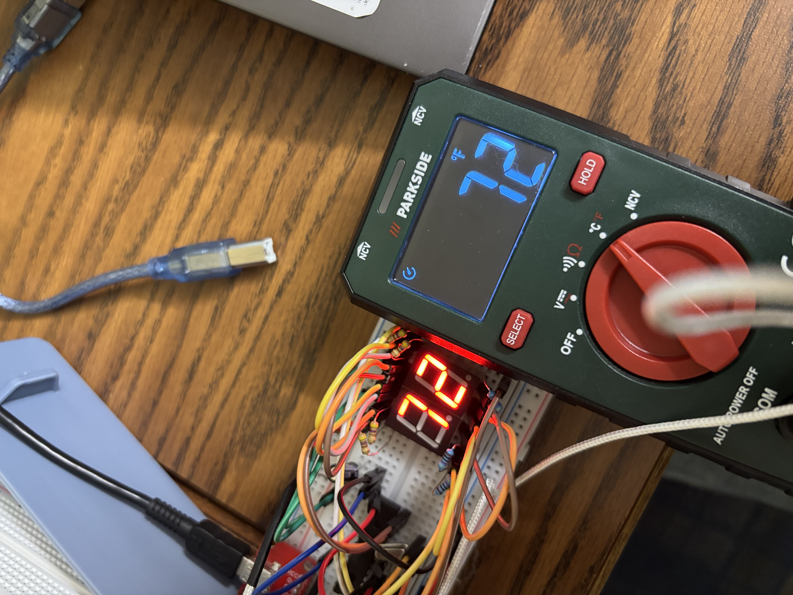

# Arduino Thermometer

## Project Status: Standalone Migration
I have migrated the project off the Arduino Uno and onto a standalone ATmega328P chip.

### Current Progress
* Ported the circuit to a standalone ATmega328P-PU.
* Added a 16MHz external crystal oscillator and 22pF capacitors for timing.
* Added a 10kΩ pull-up resistor for the Reset pin.
* Verified the code still works with the new hardware setup.

