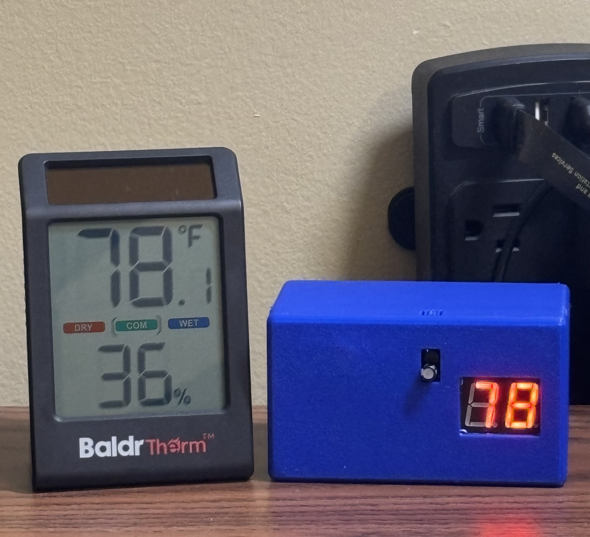
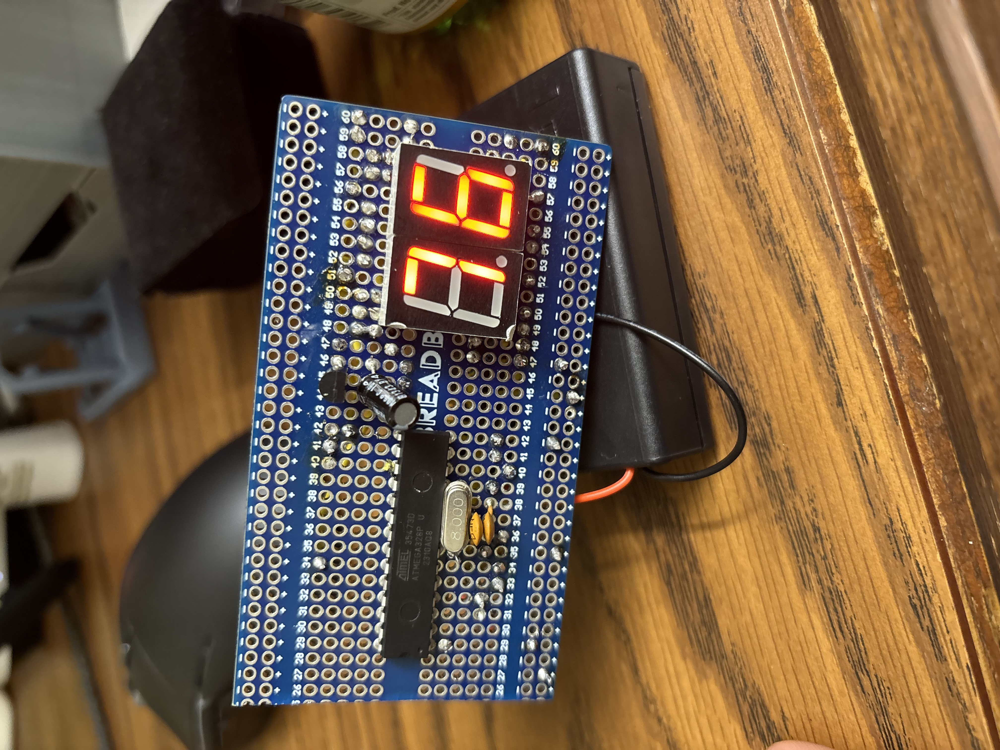

# Standalone ATmega328P Thermometer

A custom-built digital thermometer using a standalone ATmega328P chip, a TMP37 sensor, and dual 7-segment displays. Designed to run on 3xAA batteries with a custom 3D-printed enclosure.

## Features
* **Standalone Operation:** Migrated from Arduino Uno to a raw ATmega328P with 16MHz external crystal.
* **Power Efficient:** Refreshes every 5 seconds to save battery life.
* **Signal Processing:** Implemented a 100-sample averaging filter to stabilize readings.
* **Custom Enclosure:** Designed in OnShape with precise tolerances for the breadboard and sensor airflow.

---

## Engineering Challenges & Solutions

### 1. The Flicker Issue
**Problem:** Initially, the 7-segment display updated too frequently, making the numbers unreadable.
**Solution:** I refactored the code to introduce a 5-second non-blocking delay loop, ensuring the display holds a steady value for readability while maintaining the multiplexing refresh rate.

### 2. The "Rescue Mission": Fixing Voltage Drift
**Problem:** After soldering the final circuit, I realized the readings were consistently off by ~10°F.
* **Root Cause:** The code used the standard 5V analog reference. However, the battery pack provided ~4.5V (which drops over time). Since `analogRead()` compares the sensor voltage to the supply voltage, a dropping supply made the temperature look higher than it was.
* **The Fix:** I switched the code to use the ATmega328P's internal 1.1V reference, which is stable regardless of battery voltage.
* **The constraint:** Since the chip was already soldered to the board, I couldn't remove it. I wired an Arduino Uno as an ISP (In-System Programmer) to re-flash the chip while on the perfboard.

---

## Build Process (Timeline)

<strong>Click to expand the full Build Log</strong>

### Phase 1: Prototyping (Mid-Nov)
I started by simulating the circuit in **Tinkercad** to verify the logic before moving to a breadboard.

### Phase 2: Breadboarding & Migration (Late Nov)
Moved from an Arduino Uno to a standalone breadboard setup. This required adding the 16MHz crystal oscillator, 22pF capacitors, and a 10kΩ pullup resistor for the Reset pin.

### Phase 3: Assembly (Early Dec)
Soldered components onto a sawed-off perfboard. The layout was optimized to fit the custom enclosure, with the sensor positioned near the airflow vents.

---

## Project Structure
* `src/` - The final C code for the ATmega328P.
* `models/` - .STEP files for the 3D printed case (Top & Bottom).
* `Assets/` - Project photos and diagrams.

## Bill of Materials
| Component | Quantity | Note |
| :--- | :--- | :--- |
| ATmega328P | 1 | Microcontroller (DIP-28) |
| TMP37 | 1 | Temperature Sensor (Analog) |
| 7-Segment Display | 2 | Common Anode |
| 16MHz Crystal | 1 | External Oscillator |
| 22pF Capacitor | 2 | For Crystal Oscillator |
| 100microF Capacitor | 1 | For Temp Sensor |
| 10kΩ Resistor | 1 | Pull-up for Reset Pin |
| 330Ω Resistor | 7 | Current Limiting (Segments) |
| AA Battery Holder | 1 | 3-Slot with On/Off Switch |
| Perfboard | 1 | Cut to size |