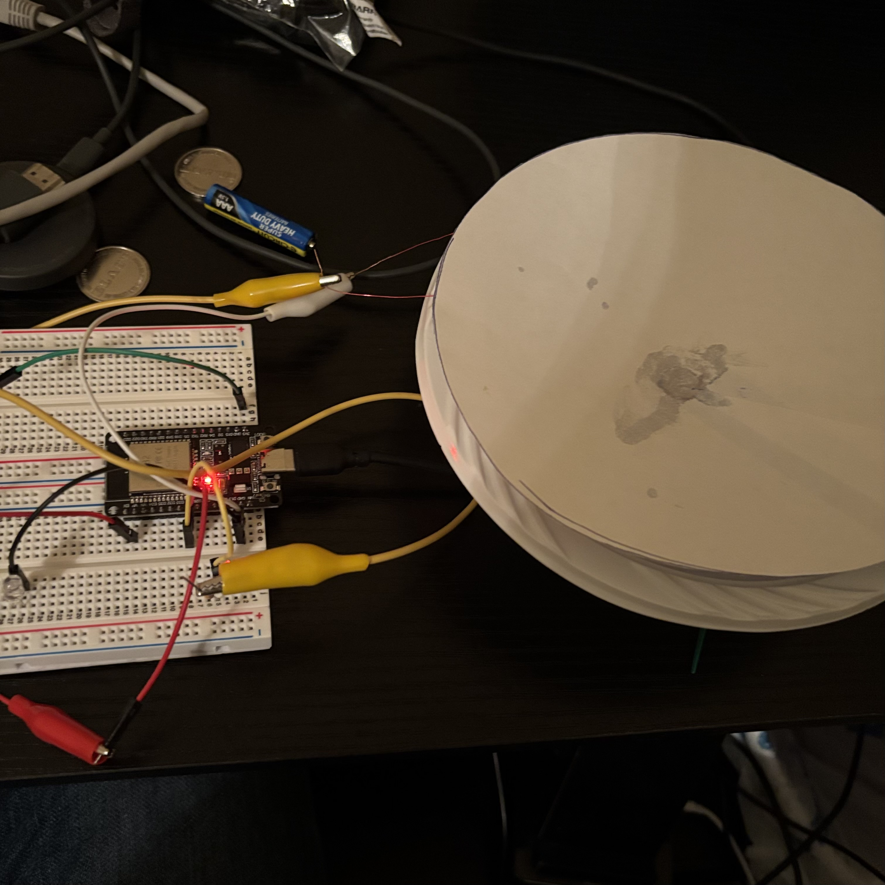

# ESP32 Bluetooth Speaker
A custom-built speaker driver made from a paper bowl and copper coil, driven by an ESP32 via Bluetooth A2DP.

## Current Status
Bluetooth works, but driving the coil directly from the ESP32 GPIO results in very low volume.

