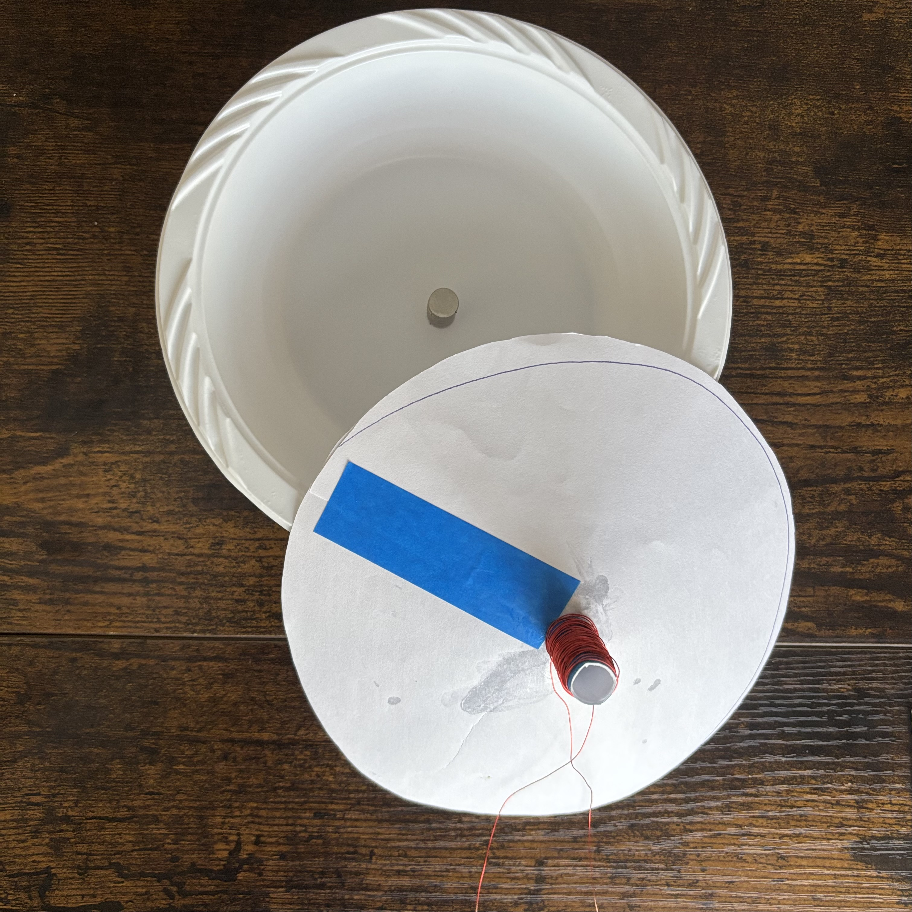
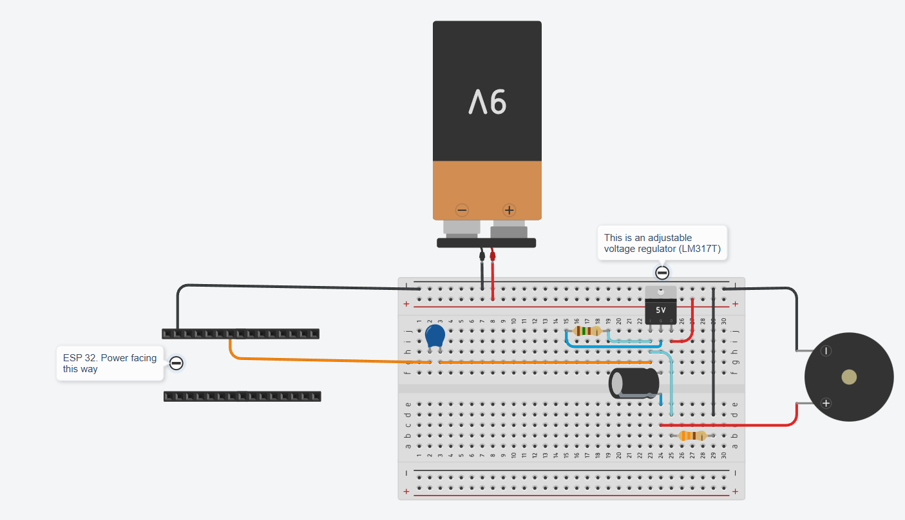
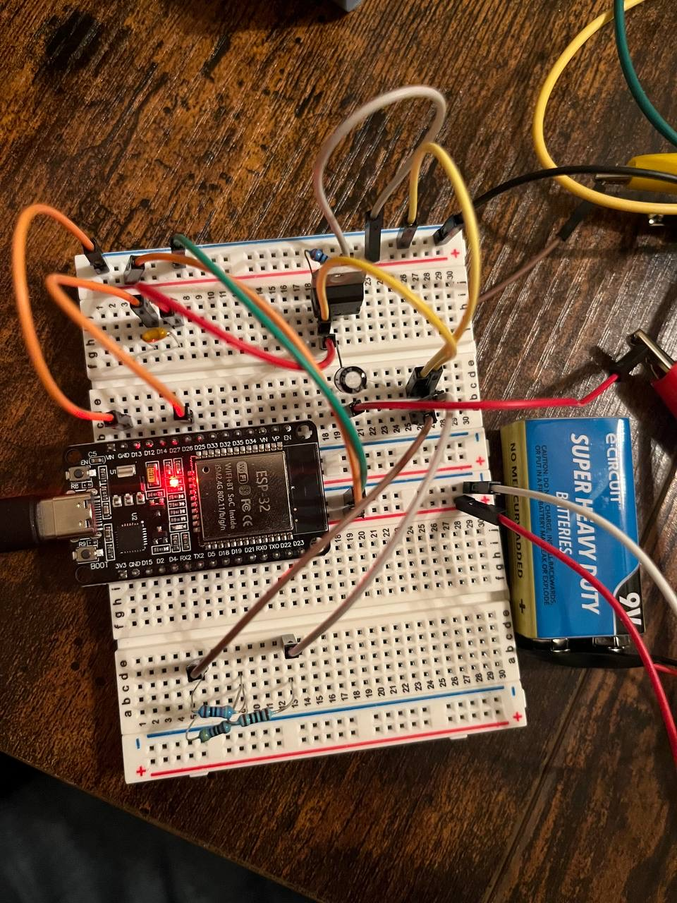

# ESP32 Bluetooth Speaker (Homemade Driver)

A fully custom audio system built from scratch. I constructed the physical speaker driver using a paper bowl, magnets, and voice coil, and engineered a Single-Ended Class A Amplifier to drive it using an ESP32 via Bluetooth A2DP.

## Features
* **Custom Electromechanics:** Built the speaker driver manually to understand the physics of the analog output stage.
* **Class A Amplification:** Engineered a high-current buffer using an LM317T to boost the ESP32's DAC signal.
* **Bluetooth Streaming:** Implements an A2DP Sink to stream high-quality audio wirelessly.
* **Software Synthesis:** Capable of generating waveforms (Sine, Noise) and MIDI notes directly on the chip.

---

## Engineering Challenges & Solutions

### 1. Physical Driver Construction
**Problem:** Getting a consistent sound without a commercial speaker.
**Solution:** I verified the physics by generating simple square waves first. Once I confirmed the coil was interacting with the magnetic field (creating vibration), I optimized the coil winding density and magnet stacking to maximize efficiency.

### 2. The "Quiet" Issue (Impedance & Power)
**Problem:** Initially, I connected the voice coil directly to the ESP32's DAC pin (GPIO 25). The volume was nearly inaudible because the DAC provides 3.3V at very low current (~40mA), which couldn't drive the electromagnetic load of the coil effectively.
**Solution:** I needed a current buffer. I built a Single-Ended Class A Amplifier using an LM317T voltage regulator. By biasing the regulator to ~4.5V and modulating the adjustment pin with the audio signal, I achieved a swing of 0V-9V with enough current to drive the paper cone.

---

## Build Process (Timeline)

<strong>Click to expand the full Build Log</strong>

### Phase 1: Physics Verification
I wound the copper coil and glued the magnets to verify the electromagnetic concept. I used the ESP32 to generate a simple Square Wave (Imperial March) to test basic actuation.

### Phase 2: Software Synthesis
Before moving to Bluetooth, I wrote a sound engine to generate Sine Waves (Kick Drum) and White Noise (Snare) to test the dynamic range of the driver.

### Phase 3: Bluetooth & Amplification
I integrated the A2DP library for streaming. Since the volume was low, I breadboarded the LM317T amplifier circuit.

---

## Project Structure
* `src/` - The C++ firmware for the ESP32.
* `assets/` - Schematics, photos, and demo videos.
* `README.md` - Documentation.

## Bill of Materials
| Component | Quantity | Note |
| :--- | :--- | :--- |
| ESP32-WROOM | 1 | Microcontroller (Dev Kit) |
| LM317T | 1 | Used as Class A Amplifier |
| 100µF Capacitor | 1 | Output coupling |
| BC154K Capacitor | 1 | Input coupling |
| 500Ω Potentiometer | 1 | Bias tuning |
| Neodymium Magnets | 12 | Stacked for field strength |
| Copper Wire | ~5m | Enameled (Voice Coil) |
| Paper Bowl | 1 | Diaphragm |

## Dependencies
* [ESP32-A2DP](https://github.com/pschatzmann/ESP32-A2DP)
* [arduino-audio-tools](https://github.com/pschatzmann/arduino-audio-tools)

## 🎥 Demo
